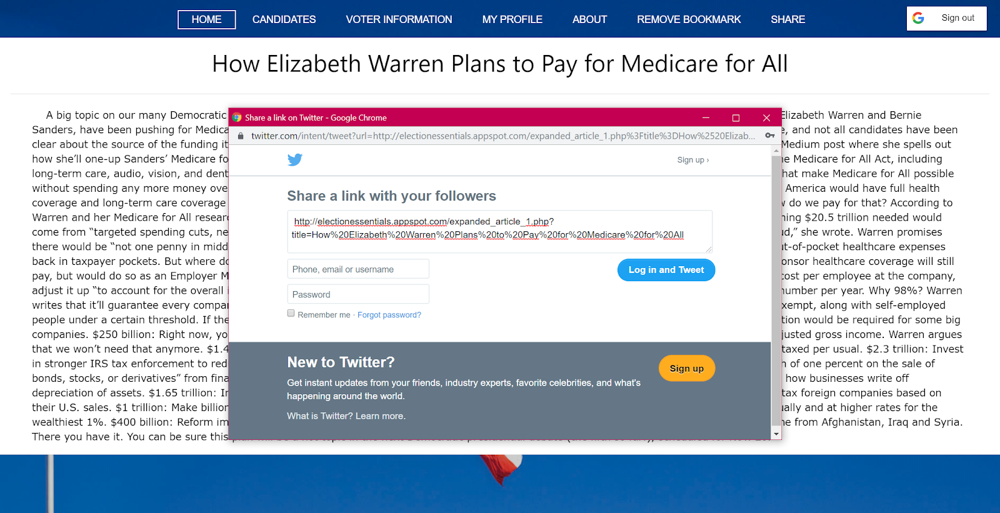
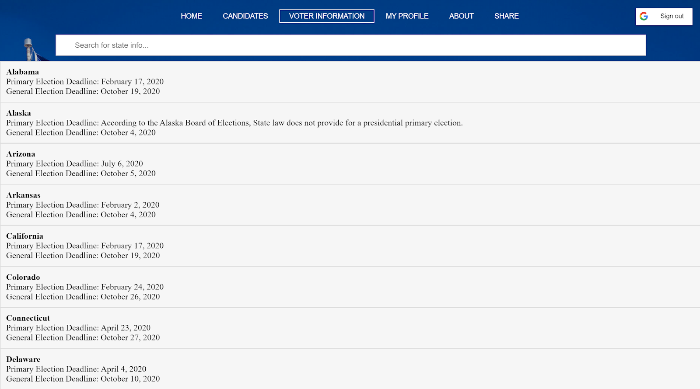

# Election Essentials :star:
A web application designed to help students identify the political topics that matter most to them and receive information regarding the 2020 election. Created by Ana Ashrafi, Austin Duong, Royce Hong, Adri Dutta, George Zhang, and Phat Le. 

## Technologies
HTML | CSS | JavaScript | PHP | Python | JQuery | MySQL | Google Cloud Platform

## Features
* [Google Sign-In](#google-sign-in)
* [Relevant News Articles](#relevant-news-articles)
* [Sharing on Twitter](#sharing-on-twitter)
* [Bookmarking](#bookmarking)
* [User Profile](#user-profile)
* [Candidate Profiles](#candidate-profiles)
* [Voting Information by State](#voting-information-by-state)

### Google Sign-In
Upon entry of our website, you will see different political topics that you can select from. Once you select the topics that matter the most to you, you will be given relevant new articles on those topics. If you want to save your selections for the future, you can sign-in with a Google account and it will save all of your activity in your user profile.

### Relevant News Articles

Once you submit your essentials, you'll be taken to your news feed, which displays all recent articles that are relevent to your essentials and the 2020 election. 

You can click on any article to view its contents without leaving our site.

### Sharing on Twitter
If you find an article interesting and want to share it with your peers, you can click the share button to share it on Twitter.

### Bookmarking
If you want to save an article for later, you can bookmark it and view it in your user profile.

### User Profile
If you want to see the essentials you originally selected or update your essentials, you may do so in your user profile.

### Candidate Profiles
To view the candidates who are running for the 2020 election, you can go to the candidates page. Democrats are represented with the color blue and Republicans are respresented with the color red.

To see more information about a candidate, you can click on their name/picture to be taken to their candidate profile. Their profiles give insight into what their stances are on various political topics and link to their campaign websites if you're interested in learning more.

### Voting Information by State
To stay up to date with voting deadlines in your state, you can go to the voter information page to search for your state and find all relevant deadlines.

